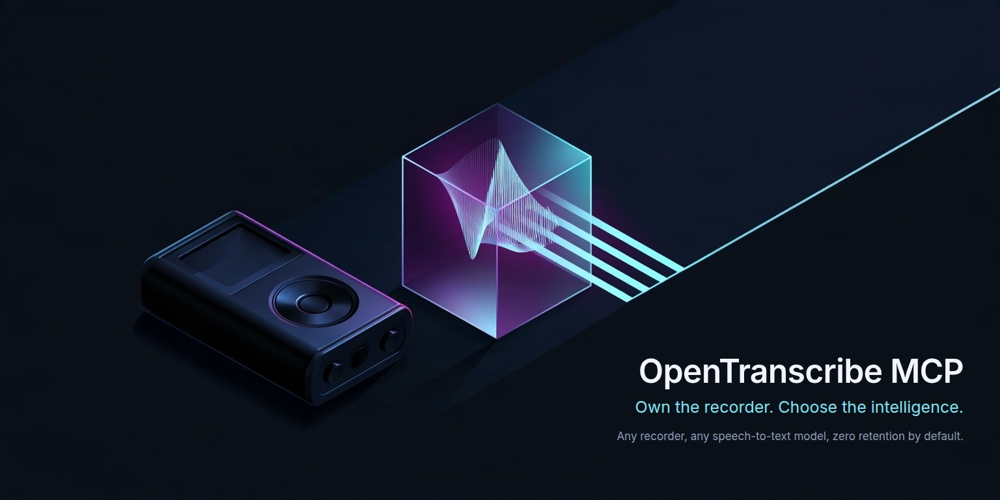
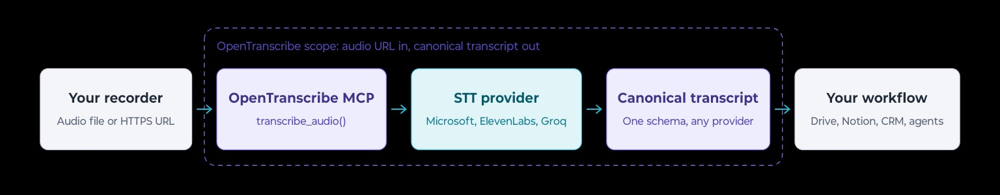

# OpenTranscribe MCP

<!-- mcp-name: io.github.fbossiere/open-transcribe-mcp -->

[](https://github.com/fbossiere/open-transcribe-mcp/actions/workflows/ci.yml)
[](https://github.com/fbossiere/open-transcribe-mcp/actions/workflows/codeql.yml)
[](LICENSE)

<p align="center">
  
</p>

**Own the recorder. Choose the intelligence.**

OpenTranscribe is an open-source MCP server that routes audio to the speech-to-text model of your choice and returns one provider-independent transcript schema.

It is built around a simple idea: buying a great recorder should not lock you into one transcription subscription. Use Plaud, a phone, an open-source wearable, or any other audio source you are authorized to access, then choose Microsoft MAI, ElevenLabs Scribe, or Groq Whisper without changing the downstream workflow.

OpenTranscribe does not jailbreak hardware or bypass access controls. It works only with audio the operator is authorized to access.

## How it works

<picture>
  <source media="(prefers-color-scheme: dark)" srcset="docs/assets/transcription-pipeline-dark.jpg">
  <source media="(prefers-color-scheme: light)" srcset="docs/assets/transcription-pipeline-light.jpg">
  
</picture>

OpenTranscribe keeps the integration boundary stable: the recorder supplies an audio file or HTTPS URL, the server selects or calls the requested speech-to-text provider, and downstream tools receive the same canonical transcript shape.

## What v1 ships

- MCP Streamable HTTP at `/mcp`, with stateless operation and bearer authentication
- `transcribe_audio`, `list_transcription_models`, `estimate_transcription_cost`, `get_transcript_chunk`, and `delete_transcript`
- Microsoft `MAI-Transcribe-2`, ElevenLabs `scribe-v2`, and Groq Whisper adapters
- explicit capability negotiation, routing policies, retries, and observable fallbacks
- HTTPS URL passthrough when supported and a bounded streaming proxy otherwise
- SSRF controls, signed-URL redaction, zero content logging, and cost/resource limits
- disabled-by-default retention; optional memory or S3-compatible temporary result storage
- Docker, production-oriented Scaleway Serverless Containers Terraform, tests, and GitHub Actions CI

## Ten-minute quickstart

Requirements: Python 3.12 and [uv](https://docs.astral.sh/uv/), or Docker.

```bash
git clone https://github.com/fbossiere/open-transcribe-mcp.git
cd open-transcribe-mcp
cp .env.example .env
```

Edit `.env` with one provider credential and a strong random MCP bearer token. For Microsoft:

```dotenv
OT_MICROSOFT__ENDPOINT=https://YOUR-RESOURCE.cognitiveservices.azure.com
OT_MICROSOFT__API_KEY=YOUR-KEY
OT_SECURITY__BEARER_TOKEN=YOUR-RANDOM-TOKEN
```

Start the server:

```bash
uv sync
uv run open-transcribe-mcp
```

The MCP endpoint is `http://localhost:8000/mcp`; probes are available at `/healthz` and `/readyz`.

Run the included bilingual, two-voice synthetic recording through the connected provider:

```bash
uv run python examples/transcribe.py --token YOUR-RANDOM-TOKEN
```

The [fixture and reference transcript](tests/fixtures/README.md) are non-sensitive and
redistributable. Pass another authorized public HTTPS audio URL as the first argument to use your
own source.

Connect a FastMCP client:

```python
import asyncio
from fastmcp import Client


async def main() -> None:
    async with Client("http://localhost:8000/mcp", auth="YOUR-RANDOM-TOKEN") as client:
        models = await client.call_tool("list_transcription_models", {})
        print(models)
        result = await client.call_tool(
            "transcribe_audio",
            {
                "request": {
                    "source": {"type": "url", "url": "https://example.org/authorized-audio.mp3"},
                    "provider": "auto",
                    "routing_policy": "quality",
                }
            },
        )
        print(result)


asyncio.run(main())
```

Provider choice does not alter the response contract. Set `provider` and `model` to switch explicitly, or use `auto` with `default`, `quality`, `cost`, or `latency` routing.

`diarization`, `timestamps`, and `transcript_style` are unset above on purpose: an unset capability is not requested, so the request routes to any configured model and the response metadata reports what that model applied. Stating one makes it a requirement — `"diarization": True` excludes every model that cannot diarize rather than quietly returning a single-speaker transcript. See [providers and capabilities](docs/providers.md).

## Docker

```bash
docker build -t open-transcribe-mcp:1.1.0 .
docker run --rm -p 8000:8000 \
  -e OT_ENVIRONMENT=prod \
  -e OT_MICROSOFT__ENDPOINT="https://YOUR-RESOURCE.cognitiveservices.azure.com" \
  -e OT_MICROSOFT__API_KEY="YOUR-KEY" \
  -e OT_SECURITY__AUTH_MODE=bearer \
  -e OT_SECURITY__BEARER_TOKEN="YOUR-RANDOM-TOKEN" \
  open-transcribe-mcp:1.1.0
```

The published image is also available as `ghcr.io/fbossiere/open-transcribe-mcp:1.1.0`.

## Configuration

All settings use the `OT_` prefix and `__` for nesting. See [.env.example](.env.example). Provider credentials are server-side environment variables and are never accepted as MCP tool arguments.

Temporary storage is disabled by default. `result_mode=stored` requires:

```dotenv
OT_RESULT_STORE__BACKEND=memory  # local/test only; use s3 for horizontally scaled production
OT_RESULT_STORE__CURSOR_SECRET=ANOTHER-RANDOM-SECRET
```

For Scaleway Object Storage, install the `s3` extra and configure the S3 bucket/endpoint variables documented in [the deployment guide](docs/deploy-scaleway.md).

The reference Scaleway deployment is codified in [`infra/scaleway`](infra/scaleway/README.md). It provisions a private image registry, a scale-to-zero Serverless Container, health probes, HTTPS-only ingress, and an optional TTL-bound result bucket with a dedicated runtime identity.

## Security and privacy defaults

- source HTTPS is required;
- private, loopback, link-local, multicast, reserved, and metadata destinations are rejected;
- every redirect target is resolved and validated;
- proxy downloads connect to the validated public IP while preserving HTTPS SNI and the original Host header;
- source downloads are streamed to an ephemeral file with byte limits, then deleted;
- signed URL queries, audio, transcript text, authorization headers, and phrase hints are not logged;
- no project telemetry is emitted;
- transcripts are not retained unless a result store is explicitly enabled and used.
- ElevenLabs zero-retention requests are enabled by default; disabling them is an explicit operator choice.

Read [SECURITY.md](SECURITY.md), [the threat model](docs/security.md), and [the retention policy](docs/privacy.md) before exposing the service publicly.

## Known limitations

OpenTranscribe v1.0 targets self-hosted, single-tenant installations. Provider feature parity is deliberately not guaranteed; capability negotiation exposes differences instead of hiding them. URL ingestion is the only remote input type. Synchronous provider limits still apply. OIDC and asynchronous jobs are planned for later releases. The memory store is neither durable nor horizontally scalable. S3 lookups prioritize a simple deployment contract over very-large-bucket indexing; dedicate the result prefix and enforce lifecycle deletion.

Application controls do not replace network policy. Internet-facing operators should still combine exact source-host allow-listing with egress firewall rules.

Provider prices, APIs, and capabilities change. The checked-in metadata is informational, not a contractual quote.

## Recording consent

> OpenTranscribe processes audio supplied by the operator. Recording and transcribing people may be subject to consent, privacy, employment, telecommunications, or data-protection laws. Operators are responsible for ensuring they have the necessary rights and consent.

Transcript content is untrusted data. OpenTranscribe never interprets it as instructions; downstream agents must preserve the same boundary.

## Documentation

The canonical documentation site is [fbossiere.github.io/open-transcribe-mcp](https://fbossiere.github.io/open-transcribe-mcp/).

- [Architecture](docs/architecture.md)
- [Providers and capabilities](docs/providers.md)
- [Security model](docs/security.md)
- [Privacy and retention](docs/privacy.md)
- [Scaleway deployment](docs/deploy-scaleway.md)
- [Release process](docs/releasing.md)
- [Tutorial: Plaud on Ubuntu, step by step](docs/tutorials/plaud-ubuntu.md) ([PDF](docs/tutorials/plaud-ubuntu.pdf))
- [Plaud recipe](docs/recipes/plaud.md)
- [ChatGPT + Google Drive recipe](docs/recipes/chatgpt-gdrive.md)
- [Contributing](CONTRIBUTING.md)
- [Governance](GOVERNANCE.md)
- [Support](SUPPORT.md)
- [Full product and technical specification](SPEC.md)

## Contributing

Contributions are welcome. Start with the [contribution guide](CONTRIBUTING.md); open a feature issue before substantial work, and report vulnerabilities only through the private process in [SECURITY.md](SECURITY.md).

## Independence and trademarks

OpenTranscribe is an independent open-source project maintained by its contributors. It is not affiliated with, endorsed by, or sponsored by Plaud, Microsoft, ElevenLabs, Groq, or any transcription provider.

Plaud and all provider product names are trademarks of their respective owners.

## License

Apache License 2.0. See [LICENSE](LICENSE).
