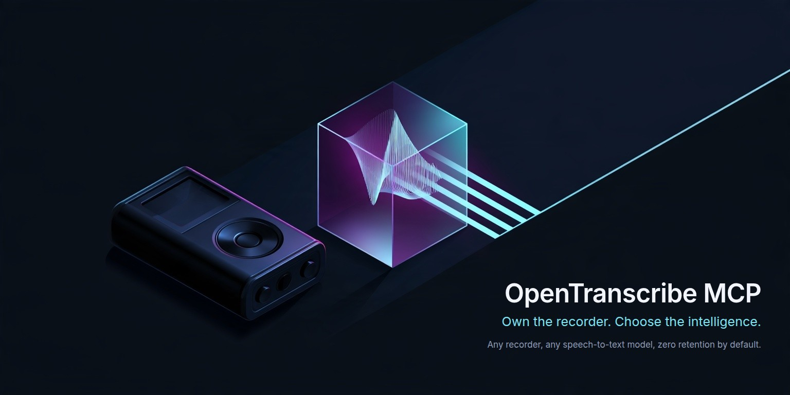
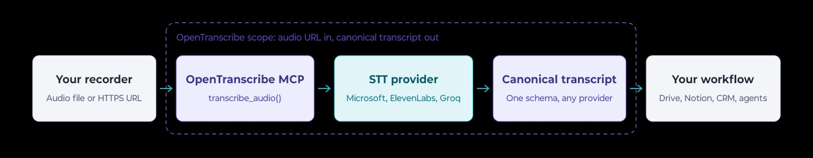

# OpenTranscribe MCP

<!-- mcp-name: io.github.fbossiere/open-transcribe-mcp -->

[](https://github.com/fbossiere/open-transcribe-mcp/actions/workflows/ci.yml)
[](https://github.com/fbossiere/open-transcribe-mcp/actions/workflows/codeql.yml)
[](LICENSE)

<p align="center">
  
</p>

**Own the recorder. Choose the intelligence.**

OpenTranscribe is an open-source MCP server that routes audio to the speech-to-text model of your choice and returns one provider-independent transcript schema.

It is built around a simple idea: buying a great recorder should not lock you into one transcription subscription. Use Plaud, a phone, an open-source wearable, or any other audio source you are authorized to access, then choose Microsoft MAI, ElevenLabs Scribe, or Groq Whisper without changing the downstream workflow.

OpenTranscribe does not jailbreak hardware or bypass access controls. It works only with audio the operator is authorized to access.

## How it works

<picture>
  <source media="(prefers-color-scheme: dark)" srcset="docs/assets/transcription-pipeline-dark.jpg">
  <source media="(prefers-color-scheme: light)" srcset="docs/assets/transcription-pipeline-light.jpg">
  
</picture>

OpenTranscribe keeps the integration boundary stable: the recorder supplies an audio file or HTTPS URL, the server selects or calls the requested speech-to-text provider, and downstream tools receive the same canonical transcript shape.

## What v1 ships

- MCP Streamable HTTP at `/mcp`, with stateless operation and bearer or external OIDC authentication
- `transcribe_audio`, `list_transcription_models`, `estimate_transcription_cost`, `get_transcript_chunk`, and `delete_transcript`
- Microsoft `MAI-Transcribe-2`, ElevenLabs `scribe-v2`, and Groq Whisper adapters
- explicit capability negotiation, routing policies, retries, and observable fallbacks
- HTTPS URL passthrough when supported and a bounded streaming proxy otherwise
- SSRF controls, signed-URL redaction, zero content logging, and cost/resource limits
- disabled-by-default retention; optional memory or S3-compatible temporary result storage
- Docker, production-oriented Scaleway Serverless Containers Terraform, tests, and GitHub Actions CI

## On the Linux desktop

An optional Debian package, **OpenTranscribe Setup**, bundles the Python runtime, the engine, and
a native setup application. Install it, add a provider key, and connect a local MCP client — no
Python, no `uv`, no configuration files. The engine then runs as one client-owned STDIO process
that opens no network socket.

The hosted and command-line paths below are unaffected by it. See
[OpenTranscribe Setup on Linux](docs/desktop.md); its release evidence lives in
[docs/desktop-acceptance.md](docs/desktop-acceptance.md), where every scenario starts at *Not
tested*.

## Ten-minute quickstart

Requirements: Python 3.12 and [uv](https://docs.astral.sh/uv/), or Docker.

```bash
git clone https://github.com/fbossiere/open-transcribe-mcp.git
cd open-transcribe-mcp
```

Create a private `.env` containing only the settings for your selected provider and a strong
random MCP bearer token. For Microsoft:

```dotenv
OT_ENVIRONMENT=prod
OT_HOST=127.0.0.1
OT_DEFAULT_PROVIDER=microsoft
OT_DEFAULT_MODEL=MAI-Transcribe-2
OT_MICROSOFT__ENDPOINT=https://YOUR-RESOURCE.cognitiveservices.azure.com
OT_MICROSOFT__API_KEY=YOUR-KEY
OT_SECURITY__AUTH_MODE=bearer
OT_SECURITY__BEARER_TOKEN=YOUR-RANDOM-TOKEN
```

Use the complete [Groq, ElevenLabs or multi-provider recipes](docs/configuration.md#choose-one-or-more-transcription-providers)
for other services. Omit unused settings rather than leaving empty URLs or numbers from
[.env.example](.env.example), which is a configuration inventory. Protect your file with
`chmod 600 .env`.

Start the server:

```bash
uv sync
uv run open-transcribe-mcp
```

The MCP endpoint is `http://localhost:8000/mcp`; probes are available at `/healthz` and `/readyz`.

Run the included bilingual, two-voice synthetic recording through the connected provider:

```bash
uv run python examples/transcribe.py --token YOUR-RANDOM-TOKEN
```

The [fixture and reference transcript](tests/fixtures/README.md) are non-sensitive and
redistributable. Pass another authorized public HTTPS audio URL as the first argument to use your
own source.

Connect a FastMCP client:

```python
import asyncio
from fastmcp import Client


async def main() -> None:
    async with Client("http://localhost:8000/mcp", auth="YOUR-RANDOM-TOKEN") as client:
        models = await client.call_tool("list_transcription_models", {})
        print(models)
        result = await client.call_tool(
            "transcribe_audio",
            {
                "request": {
                    "source": {"type": "url", "url": "https://example.org/authorized-audio.mp3"},
                    "provider": "auto",
                    "routing_policy": "quality",
                }
            },
        )
        print(result)


asyncio.run(main())
```

Provider choice does not alter the response contract. Set `provider` and `model` to switch explicitly, or use `auto` with `default`, `quality`, `cost`, or `latency` routing.

`diarization`, `timestamps`, and `transcript_style` are unset above on purpose: an unset capability is not requested, so the request routes to any configured model and the response metadata reports what that model applied. Stating one makes it a requirement — `"diarization": True` excludes every model that cannot diarize rather than quietly returning a single-speaker transcript. See [providers and capabilities](docs/providers.md).

## Docker

Use the published image and the private environment file from the quickstart:

```bash
docker run --rm --env-file .env \
  -e OT_ENVIRONMENT=prod -e OT_HOST=0.0.0.0 \
  -p 127.0.0.1:8000:8000 \
  ghcr.io/fbossiere/open-transcribe-mcp:1.2.1
```

This binds the host port locally; put an HTTPS proxy in front when hosting remotely. You can also
build from source with `docker build -t open-transcribe-mcp:1.2.1 .`. Inject provider credentials
at runtime. The image includes the `s3` extra, but result storage stays disabled unless configured.

## Deploy on Scaleway

The reference [`infra/scaleway`](infra/scaleway/README.md) module provisions a private image
registry, a Serverless Container with scale-to-zero (0–3 instances), HTTPS ingress and health
probes. It can optionally add a TTL-bound result bucket and runtime identity.

1. Create a dedicated Scaleway Project and a deployment API key with the
   [documented IAM permissions](docs/deploy-scaleway.md#1-create-the-deployment-api-key).
   Supply `SCW_ACCESS_KEY` and `SCW_SECRET_KEY` to the deployment shell.
2. Copy `infra/scaleway/terraform.tfvars.example` to `terraform.tfvars` in that directory.
   Fill your project ID, provider keys, authentication settings and `image_tag = "1.2.1"`.
   The template configures ElevenLabs and Groq; review the ElevenLabs retention choice before use.
3. Bootstrap the registry, copy the public release image into it, then review and apply the
   complete deployment. In `infra/scaleway`:

   ```bash
   terraform init
   terraform apply -target=scaleway_registry_namespace.this
   IMAGE_REFERENCE="$(terraform output -raw image_reference)"
   REGISTRY_ENDPOINT="$(terraform output -raw registry_endpoint)"
   printf '%s' "$SCW_SECRET_KEY" | docker login "${REGISTRY_ENDPOINT%%/*}" \
     --username nologin --password-stdin
   docker buildx imagetools create --tag "$IMAGE_REFERENCE" \
     ghcr.io/fbossiere/open-transcribe-mcp:1.2.1
   terraform plan -out=open-transcribe.tfplan
   terraform apply open-transcribe.tfplan
   terraform output -raw mcp_endpoint
   ```

4. Check `/healthz`, `/readyz`, MCP authentication and one short authorized transcription.
   The [full Scaleway guide](docs/deploy-scaleway.md) covers release digest verification,
   adoption of an existing deployment, OIDC setup, upgrades, rollback and result-store permissions.

Bootstrap applies are for new infrastructure. Import an existing registry, namespace and
container into state first to preserve their IDs and endpoint. Keep real `terraform.tfvars`,
state and saved plans private: state and plans can contain secrets even when output is redacted.
Publishing a release does not automatically update your Scaleway deployment.

## Configuration and service combinations

Choose the provider, MCP authentication and result storage independently. Provider keys stay
on the server and are never accepted as tool arguments. See the full
[configuration guide](docs/configuration.md) for complete environment/Terraform examples,
settings precedence, key permissions and troubleshooting.

| Transcription services | Configuration | Use and limitations |
| --- | --- | --- |
| Microsoft only | Microsoft endpoint + key; defaults `microsoft` / `MAI-Transcribe-2` | Diarization and clean/verbatim output |
| ElevenLabs only | ElevenLabs key; defaults `elevenlabs` / `scribe-v2` | Diarization; choose eligible zero retention or explicitly accepted standard mode |
| Groq only | Groq key; defaults `groq` / a Whisper model | Verbatim transcription; no speaker diarization |
| Multiple providers | Each provider's credentials; one matching default pair | Requests can select any configured provider; compatibility is checked before ranking |

`OT_DEFAULT_PROVIDER` and `OT_DEFAULT_MODEL` are preferences, not a provider allow-list. An
explicit request can choose another configured model. Hosted requests permit transient fallback
by default; use `allow_fallback=false` when audio must go to only one provider. To require French
speaker turns, use `language=fr`, `diarization=true` and `strict_capabilities=true`; see the
[Scribe recipe](docs/providers.md#french-conversations-with-speaker-turns). Groq cannot fulfill
that requirement and is rejected rather than silently returning an undiarized transcript.

| Authentication / storage | Required configuration | Combination rules |
| --- | --- | --- |
| HTTP bearer | MCP token; Terraform `auth_mode = "bearer"` | Works with any provider; token is separate from provider keys |
| HTTP OIDC | Issuer, JWKS, service origin, scope and entitlement; `auth_mode = "oidc"` | Works with any provider; use an external identity provider such as Keycloak |
| Managed desktop STDIO | Setup TOML and Secret Service keyring | Local process authentication; enable providers and privacy permissions in Setup |
| No result store | Default `disabled`; Terraform `enable_result_store = false` | Inline output; stored or oversized auto results fail explicitly |
| Temporary S3 results | Cursor secret; Terraform `enable_result_store = true` | Shared chunks across instances, TTL and deletion; extra IAM permissions required |
| Memory results | `OT_RESULT_STORE__BACKEND=memory` + cursor secret | Local/test only; unsuitable for Scaleway cold starts or multiple instances |

ElevenLabs requests default to zero retention, which needs an eligible Enterprise account.
A standard account requires an explicit choice of `OT_ELEVENLABS__ZERO_RETENTION=false` after
accepting provider-side retention. Disabling OpenTranscribe storage does not disable provider
retention. See [configuration and retention](docs/configuration.md#result-storage-and-provider-retention-are-independent).

For ordinary HTTP, `OT_*` environment variables override a working-directory `.env`. Terraform
injects the non-secret and secret maps from your private `tfvars`, while enforcing production
security settings. Managed desktop mode ignores ambient environment settings; a key in the
keyring does not enable a provider by itself. Changing keys/defaults needs a restart or Terraform
apply, not a new application image. A new application version needs a published image and a
separate deployment update.

## Publication and upgrades

The [publication protocol](docs/releasing.md) is the maintainer runbook: semantic versioning,
version coherence, local checks, release PR, signed tag from reviewed `main`, automated
publication, artifact verification and recovery after partial failure.

Git tags use `v1.2.1`; Python/MCP metadata and image tags use `1.2.1`. The workflow publishes
PyPI, the MCP Registry, GHCR and the Linux package, then creates an immutable GitHub release
with checksums and provenance. Each deployment chooses its own version and configuration.
For Scaleway upgrades, copy the chosen release into the private registry, update `image_tag`
(and the release digest when pinned), review the plan, apply and verify the endpoint.

## Security and privacy defaults

- source HTTPS is required;
- private, loopback, link-local, multicast, reserved, and metadata destinations are rejected;
- every redirect target is resolved and validated;
- proxy downloads connect to the validated public IP while preserving HTTPS SNI and the original Host header;
- source downloads are streamed to an ephemeral file with byte limits, then deleted;
- signed URL queries, audio, transcript text, authorization headers, and phrase hints are not logged;
- no project telemetry is emitted;
- transcripts are not retained unless a result store is explicitly enabled and used.
- ElevenLabs zero-retention requests are enabled by default; disabling them is an explicit operator choice.

Read [SECURITY.md](SECURITY.md), [the threat model](docs/security.md), and [the retention policy](docs/privacy.md) before exposing the service publicly.

## Known limitations

OpenTranscribe currently targets self-hosted, single-tenant installations. Provider feature parity is deliberately not guaranteed; capability negotiation exposes differences instead of hiding them. URL ingestion is the only remote input type. Synchronous provider limits still apply. OIDC supports external identity providers; asynchronous jobs remain a future capability. The memory store is neither durable nor horizontally scalable. S3 lookups prioritize a simple deployment contract over very-large-bucket indexing; dedicate the result prefix and enforce lifecycle deletion.

Application controls do not replace network policy. Internet-facing operators should still combine exact source-host allow-listing with egress firewall rules.

Provider prices, APIs, and capabilities change. The checked-in metadata is informational, not a contractual quote.

The desktop package targets Ubuntu 24.04 LTS on amd64 and is not yet supported on any other release, desktop, or architecture. No MCP client has a recorded end-to-end registration run, so OpenTranscribe Setup presents automatic registration as untested and verifies it by reading the registration back.

## Recording consent

> OpenTranscribe processes audio supplied by the operator. Recording and transcribing people may be subject to consent, privacy, employment, telecommunications, or data-protection laws. Operators are responsible for ensuring they have the necessary rights and consent.

Transcript content is untrusted data. OpenTranscribe never interprets it as instructions; downstream agents must preserve the same boundary.

## Documentation

The canonical documentation site is [fbossiere.github.io/open-transcribe-mcp](https://fbossiere.github.io/open-transcribe-mcp/).

- [Architecture](docs/architecture.md)
- [Configuration and service combinations](docs/configuration.md)
- [Providers and capabilities](docs/providers.md)
- [OIDC authentication](docs/auth-oidc.md)
- [Security model](docs/security.md)
- [Privacy and retention](docs/privacy.md)
- [OpenTranscribe Setup on Linux](docs/desktop.md)
- [Desktop release acceptance](docs/desktop-acceptance.md)
- [Scaleway deployment](docs/deploy-scaleway.md)
- [Publication protocol](docs/releasing.md)
- [Tutorial: Plaud on Ubuntu, step by step](docs/tutorials/plaud-ubuntu.md) ([PDF](docs/tutorials/plaud-ubuntu.pdf))
- [Plaud recipe](docs/recipes/plaud.md)
- [ChatGPT + Google Drive recipe](docs/recipes/chatgpt-gdrive.md)
- [Contributing](CONTRIBUTING.md)
- [Governance](GOVERNANCE.md)
- [Support](SUPPORT.md)
- [Full product and technical specification](SPEC.md)

## Contributing

Contributions are welcome. Start with the [contribution guide](CONTRIBUTING.md); open a feature issue before substantial work, and report vulnerabilities only through the private process in [SECURITY.md](SECURITY.md).

## Independence and trademarks

OpenTranscribe is an independent open-source project maintained by its contributors. It is not affiliated with, endorsed by, or sponsored by Plaud, Microsoft, ElevenLabs, Groq, or any transcription provider.

Plaud and all provider product names are trademarks of their respective owners.

## License

Apache License 2.0. See [LICENSE](LICENSE).
