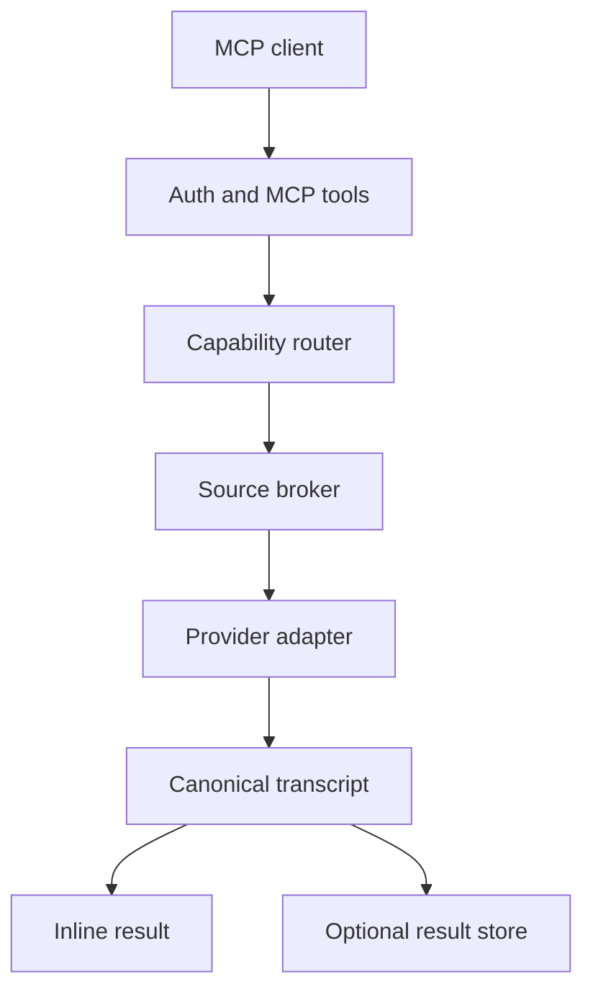

# Architecture

OpenTranscribe owns exactly one transformation: authorized audio to a normalized transcript.

The public contract is defined in `domain/`. Provider-specific request and response shapes remain inside `providers/`. The router filters configured models by explicit capabilities before applying a deterministic policy. The source broker validates URLs and chooses provider-side fetching or an ephemeral proxy file. The service applies preflight limits, invokes one provider at a time, falls back only after normalized transient failures, and chooses inline or stored output.

Normal inline operation is stateless. Memory storage exists for tests and one-process development. S3-compatible storage enables scale-to-zero and multiple instances without a database. The application does not discover recordings, summarize text, create documents, or track downstream idempotency.

## Extension boundary

A provider contribution implements `TranscriptionProvider`, declares every model capability, translates one canonical request, and returns `CanonicalTranscript`. Routing and tools do not import provider-native models.

## Trust boundaries

Client arguments, source URLs, provider responses, audio, and transcript content are untrusted. Credentials and policy configuration are trusted server-side inputs. No transcript content is executed or supplied back into routing.
